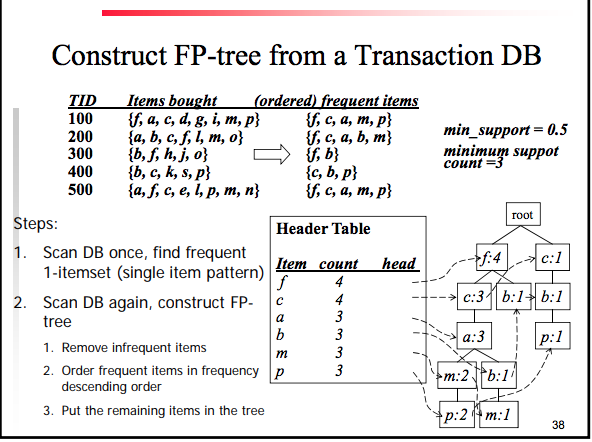
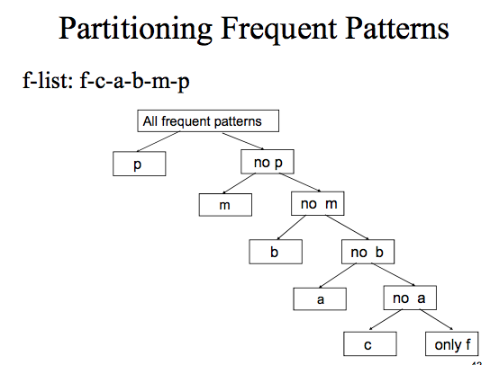

# Improving Apriori

* Shrink the number of candidates
  * Hash-table technic
  * DHP
  * Using a hash table and a strong hash function to reduce the number of candidates
  * bucket count  / bucket items
* Reduce number of database scans
  * Partitioning DB
  * Query the database in partitions
    * `SELECT WITH LIMIT X`
    * That way you do a single full database scan in multiple steps
    * You check the minimum support in every single sub set
    * Database = D
      * D -> partitions D1, D2, D3, D4
    * F is Frequent item set
      * F -> partitions F1, F2, F3, F4
    * `s1n1 + s2n2 + s3n3, s4n4 < min_support_count(s1n1 + s2n2 + s3n3 + s4n4)`
    * min_support_count -> number of transactions
    * min_support -> percentage of transactions
* Avoid candidate generation
  * FP-Growth
  * Mining Frequent Patterns Without Candidate Generation (FP-Growth)
  * Two steps:
    * Compress a large database into a compact, Frequent-Pattern tree (FP-tree) structure
      * Highly condensed, but complete for frequent pattern mining
      * Avoid costly database scan
      * 
      * Navigate the database `frequent items` and based on date create the tree (`item`:`number of occurrences`)
  * Benefits:
    * Completeness:
      * map each transaction into a path in the tree
      * preserves complete information for frequent pattern mining
        * no need to scan the database any more
    * Compactness:
      * reduce irrelevant information - infrequent items are gone
      * A path can store one or more transactions
      * Items in frequency descending order (f-list)
      * Never be larger than the original database
    * Mining Frequent Patterns from FP-trees
      * Frequent pattern = frequent itemset
      * General idea (divide and conquer):
        * Recursively
          * partition the set of frequent patterns
          * build conditional pattern base and conditional FP-tree for each partition
      * Partition the set of frequent patterns
        * Frequent patterns can be partitioned into subsets according to f-list: f-c-a-b-m-p (the list of freq. items in frequency - descending order)
        * Patterns containing `p`
        * Patterns having `m` but no `p`
        * Patterns having `c` but no `a` nor `b, m, or p`
        * Pattern f
      * 
