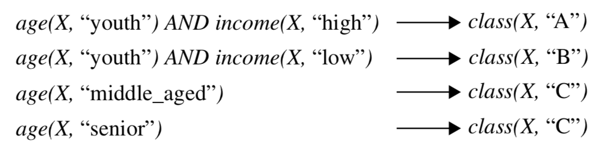
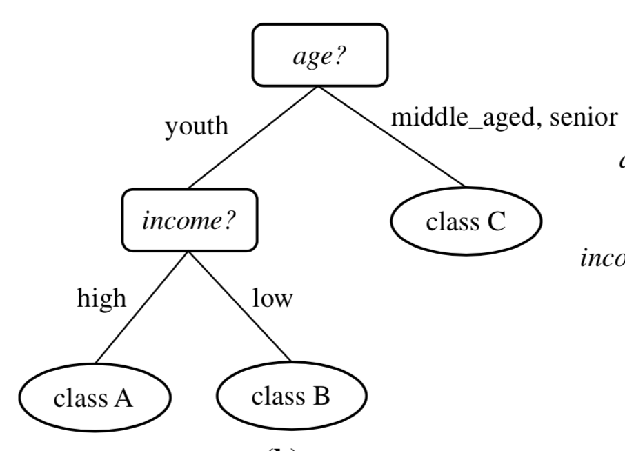
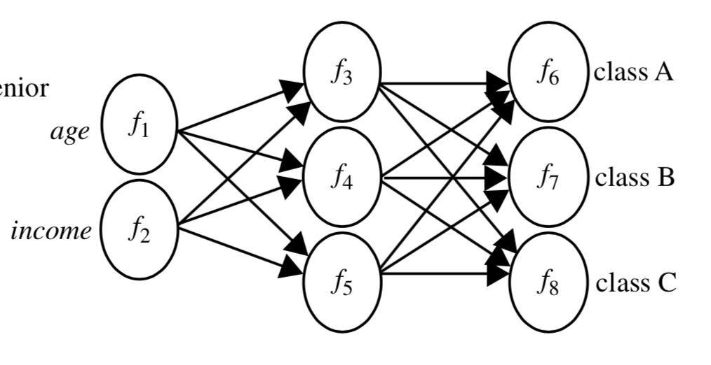

# Chapter 1

1. **Data cleaning** (to remove noise and inconsistent data)
2. **Data integration** (where multiple data sources may be combined)
3. **Data selection** (where data relevant to the analysis task are retrieved from the database)
4. **Data transformation** (where data are transformed and consolidated into forms appropriate for mining by performing summary or aggregation operations)
5. **Data mining** (an essential process where intelligent methods are applied to extract data patterns)
6. **Pattern evaluation** (to identify the truly interesting patterns representing knowledge based on interestingness measures—see Section 1.4.6)
7. **Knowledge presentation** (where visualization and knowledge representation tech- niques are used to present mined knowledge to users)

## Data Mining Functionalities
* Data mining functionalities are used to specify the kinds of patterns to be found in data mining tasks. In general, such tasks can be classified into two categories: descriptive and predictive.

  * **Descriptive mining** tasks characterize properties of the data in a target data set.
  * **Predictive mining** tasks
  perform induction on the current data in order to make predictions.


* **Class/Concept Description: characterization and discrimination**:

  * Data entries can be associated with **classes** or **concepts**. For example, in the AllElectronics store, **classes** of items for sale include **computers and printers**, and **concepts** of customers include **bigSpenders and budgetSpenders**.
  * Such descriptions of a class or a concept are called **class/concept descriptions**
    * These descriptions can be derived using **data characterization**, by summarizing the data of the class under study (often called the target class) in general terms
    * **Data discrimination**, by comparison of the target class with one or a set of comparative classes (often called the contrasting classes)
    * Both data characterization and discrimination.


  * **Data characterization**
    * Is a summarization of the general characteristics or features of a target class of data. The data corresponding to the user-specified class are typically collected by a query. For example, **to study the characteristics of software products with sales that increased by 10% in the previous year, the data related to such products can be collected by executing an SQL query on the sales database.**


  * **Data discrimination** is a comparison of the general features of the **target class** data objects **against the general features of objects from one or multiple contrasting classes**. The target and contrasting classes can be specified by a user, and the corresponding data objects can be retrieved through database queries. For example, a user may want to compare the general features of software products with sales that increased by 10% last year against those with sales that decreased by at least 30% during the same period. The methods used for data discrimination are similar to those used for data characterization.


* **Mining Frequent Patterns, Associations, and Correlations**:
  * **Frequent patterns**, as the name suggests, are patterns that occur frequently in data. There are many kinds of frequent patterns, including frequent itemsets, frequent sub- sequences (also known as sequential patterns), and frequent substructures
    * A **frequent itemset** typically refers to a set of items that often appear together in a transactional data set—for example, milk and bread, which are frequently bought together in grocery stores by many customers.
    * A frequently occurring subsequence, such as the pattern that customers, tend to purchase first a laptop, followed by a digital camera, and then a memory card, is a **frequent sequential pattern**.

  * Association analysis:
    * Suppose that, as a marketing manager at AllElectronics, you want to know which items are frequently purchased together (i.e., within the same transac- tion).
      * ```buys(X,“computer”) ⇒ buys(X,“software”) [support = 1%,confidence = 50%]```
        * X is a variable representing a customer
        * A **confidence**, or certainty, of 50% means that if a customer buys a computer, there is a 50% chance that she will buy software as well
        * A 1% **support** means that 1% of all the transactions under analysis show that computer and software are purchased together.
        * Association rules that contain a single predicate are referred to as **single-dimensional association rules**
        * Typically, association rules are **discarded** as uninteresting if they **do not satisfy both a minimum support threshold and a minimum confidence threshold**. Additional analysis can be performed to uncover interesting statistical correlations between associated attribute–value pairs.


* **Classification and Regression for Predictive Analysis**
  * **Classification** is the process of **finding a model** (or function) that **describes and distinguishes data classes or concepts**.
    * The **model are derived** based on the analysis of a set of **training data** (i.e., data objects for which the class labels are known)
    * The model is used to **predict the class label of objects for which the the class label is unknown**
    * The derived model may be represented in various forms, such as:
      * Classification rules (i.e., IF-THEN rules)
        * 
      * Decision trees
        * A decision tree is a flowchart-like tree structure, where each node denotes a test on an attribute value, each branch represents an outcome of the test, and tree leaves represent classes or class distributions
        * 
      * Mathematical formulae
      * Neural networks
       * 
       *  A neural network, when used for classification, is typ- ically a collection of neuron-like processing units with weighted connections between the units. There are many other methods for constructing classification models, such as na ̈ıve Bayesian classification, support vector machines, and k-nearest-neighbor classification.
    * Suppose as a sales manager of AllElectronics you want to **classify a large set of items in the store**, based on three kinds of responses to a sales cam- paign: **good response, mild response and no response**. You want to **derive a model for each of these three classes based on** the descriptive features of the items, such as **price, brand, place made, type, and category**. The resulting classification should maximally distinguish each class from the others, presenting an organized picture of the data set.
    Suppose that the resulting classification is expressed as a decision tree. The decision tree, for instance, may identify price as being the single factor that best distinguishes the three classes. The tree may reveal that, in addition to price, other features that help to further distinguish objects of each class from one another include brand and place made. Such a decision tree may help you understand the impact of the given sales campaign and design a more effective campaign in the future.

  * **Regression analysis**
    * Whereas classification predicts categorical (discrete, unordered) labels, **regression models** continuous-valued functions. That is, regression is used to **predict missing or unavailable numerical data values rather than (discrete) class labels**.
    * **Regression analysis** is a statistical methodology that is most often used for **numeric prediction**, although other methods exist as well. Regression also encompasses the identification of distribution trends based on the available data.
    * Suppose instead, that **rather than predicting categorical response labels for each store item,** you would like to **predict the amount of revenue that each item will generate during an upcoming sale at AllElectronics, based on the previous sales data**. This is an example of regression analysis because the regression model constructed will predict a continuous function (or ordered value.)

  * Classification and regression may need to be preceded by **relevance analysis**, which attempts to identify attributes that are significantly relevant to the classification and regression process. Such attributes will be selected for the classification and regression process. Other attributes, which are irrelevant, can then be excluded from consideration.

* Clustering analysis
  * Unlike classification and regression, which analyze class-labeled (training) data sets, **clustering analyzes data objects without consulting class labels**. In many cases, class labeled data may simply not exist at the beginning.

* outlier analysis
