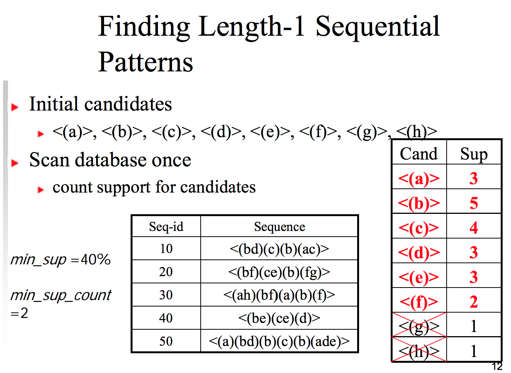
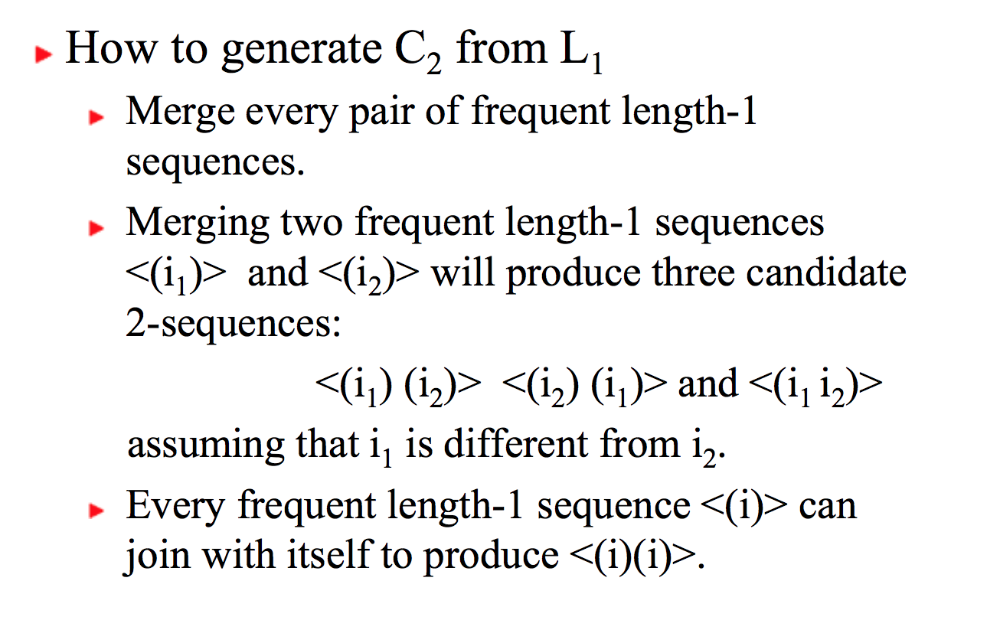
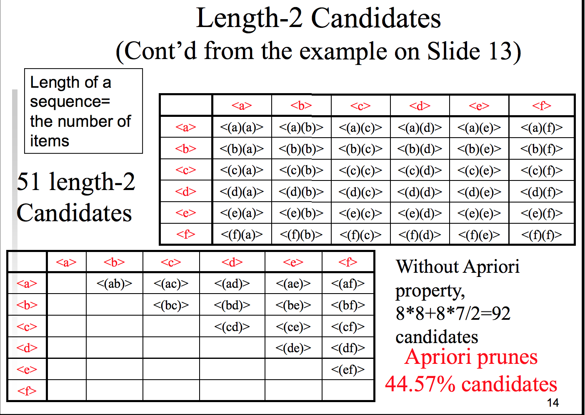

# Sixth Class

## Sequential pattern mining

* Sequence
  * Contains transactions
    * Contains items

* Trying to find frequent sequences

## Basic concepts

  * Subsequence
    * E.g., <(3) (4 5) (8)> is contained in <(7) (3 8) (9) (4 5 6) (8) >
      * (3) < (3 8) && (4 5) < (4 5 6) && (8) <= (8)

  * Support of a sequence
    * Is defined as the fraction of total
    sequences in the database that contains this sequence.

  * Frequent sequences (also called sequential patterns)
    * sequences that satisfy a minimum support (min_sup).

  * The Apriori property in sequential patterns:
    * Any nonempty subsequence of a frequent
sequence must be frequent
    * If a sequence is infrequent, then none of its super-sequences is frequent.
    *  if <(3) (4 5)> is infrequent, so are <(3) (4 5) (8)> and <(3 6) (4 5)>

### GSP - Generalized Sequential Pattern Mining

  * Considers some time constraints and item taxonomy (TREE of items -> ex: food -> beg, meet, then we have another section for clothes)
  * More general than simply mining sequential patterns

  * A Simplified Version of GSP
    * find all frequent sequences from a database of sequences given a `min_sup`
    * Length of a sequence = number of items in the sequence
      * Length of <(a)(b)> is 2
      * Length of <(a b) (c)> is 3
      * Length of <(a b)> is 2
      * A length-k sequence is also called k-sequence

  * C1 -> SCAN DB -> L1 -> C2 (Apriori) -> SCAN DB -> L2  -> C3 -> SCAN DB -> L3 -> C4...
    * Run until C or L is empty
    * 
    * 
      * <(i1, i2)>, <(i2, i1)>, <(i1,i1)>, etc..
    * 
      * We are pruning the non-frequent items (G and H) -> check images

  * How to generate Ck from Lk-1 (k>2)
    * Rank all items in an itemset in an order
    * A sequence s1 joins with s2 if the subsequence obtained by dropping the first item of s1 is the same as the subsequence obtained by dropping the last item of s2.
    * The joined sequence is s1 plus the last item of s2.
      * The added item becomes a separate element if it was a separate element in s2, or part of the last element of s1 otherwise.

    * Examples
      * Joining <(1)(2 3)(4)> and <(2 3)(4)(5)> produces <(1) (2 3)(4)(5)>
      * Joining <(1)(2 3)(4)> and <(2 3)(4 5)> produces <(1)(2 3)(4 5)>

    * After making all those joins, we will test for the `min_sup` again
      * Prune step: delete candidates in Ck that have infrequent (k-1)-subsequence
      * If <(ab)(d)>, <(b)(ad)>, <(b)(de)> are all length-3 frequent sequences, then
        * Remove `a` and remove `e` -> first and last
      * <(a)(de)> and <(ab)(e)> are infrequent, <(ab)(de)> is pruned

    * If <(a)(b)>, <(a)(a)> and <(b)(a)> are all length-2 sequential patterns, then length-3 candidates are:
      * join: <(a)(b)(a)> <(a)(a)(b)>, <(a)(a)(a)>, <(b)(a)(b)>, and <(b)(a)(a)>.
      * After pruning:
        * <(a)(b)(a)>, <(a)(a)(b)>, <(a)(a)(a)>, <(b)(a)(a)>.
        * Check the first two items

    * Another example
      * <(bd)>, <(b)(b)> and <(d)(b)>
      * Join: <(bd)b>, <(b)(bd)>, <(b)(b)(b)>, <(d)(bd)>, <(d)(b)(b)>
      * After pruning: <(bd)b>, <(b)(b)(b)>, <(d)(b)(b)>

    * Summary of Simplified GSP
      * Same as Apriori for the most part
      * Different rules

    * Bottlenecks
      * Candidate generation
      * DB Scans

### Prefix Span
  * Generate all frequent sequences without candidate generation and testing.
  * Strategy
    * Divide and conquer
      * Divide the patterns to be mined into subsets and find patterns in each subset recursively.
    * Projection-based
      * Recursively project a sequence database into a set of smaller databases based on the frequent “prefix” mined so far
      * Mine each projected database to find frequent “suffixes”
