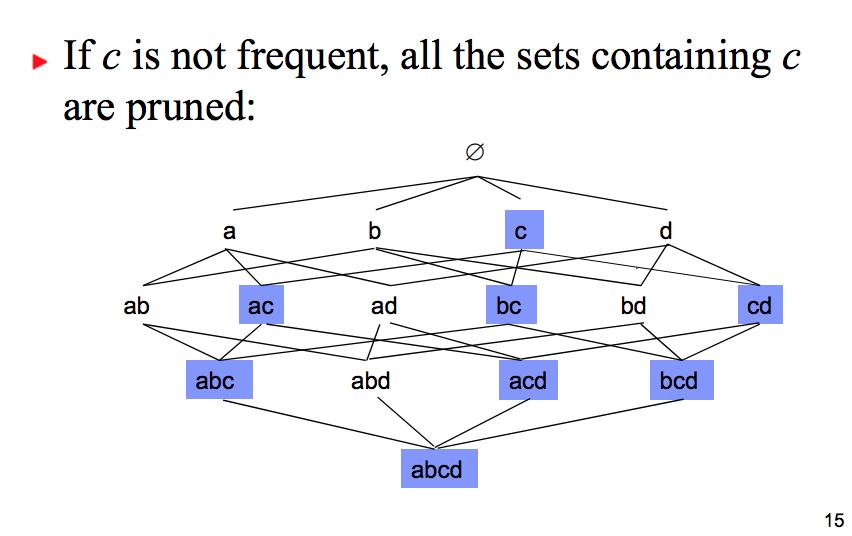
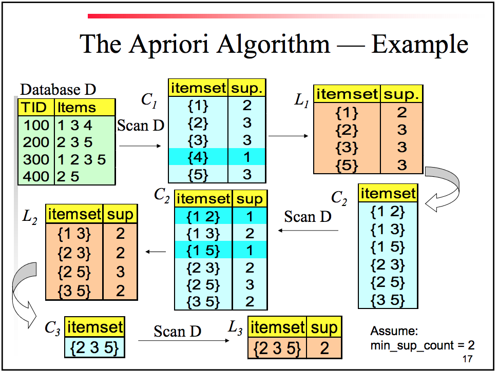
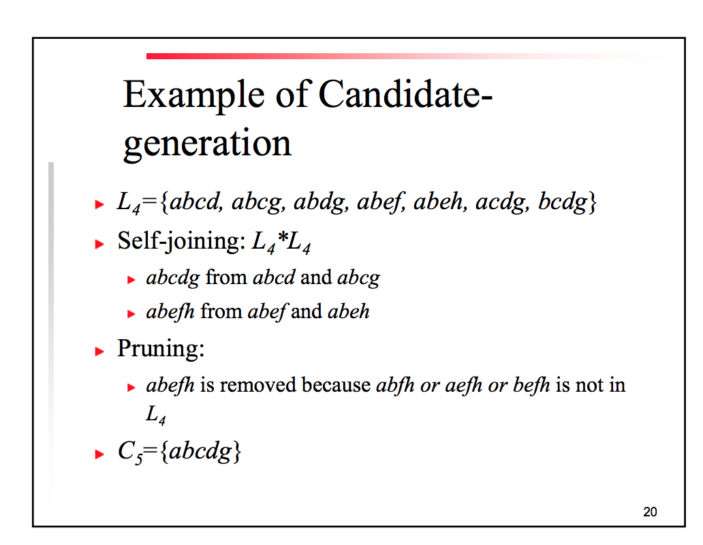
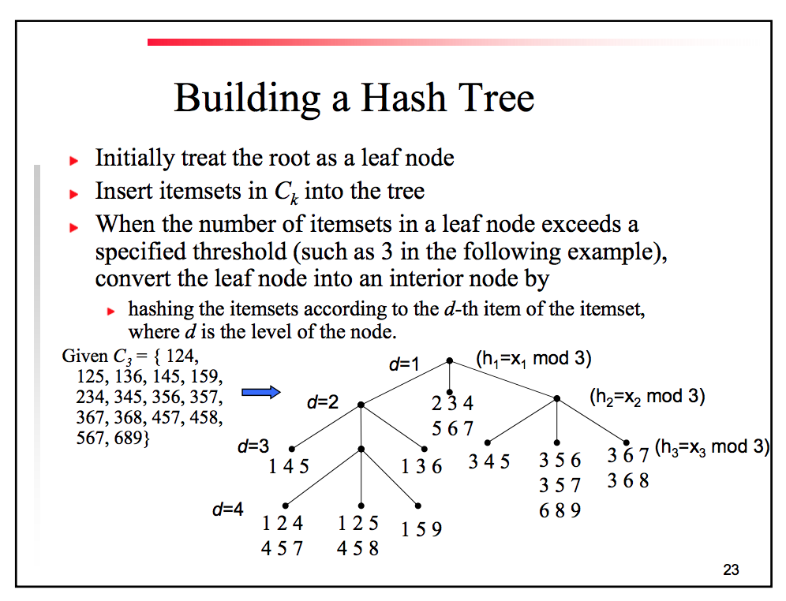

## Algs for finding frequent itemsets

# Apriori
  * Any nonempty subset of a frequent itemset must be frequent
  * If `c` is not frequent, all the sets containing `c` are pruned
  * 
  * 
    * Candidate generation to find valuable itemset
    * 
    *  
FP-Growth
